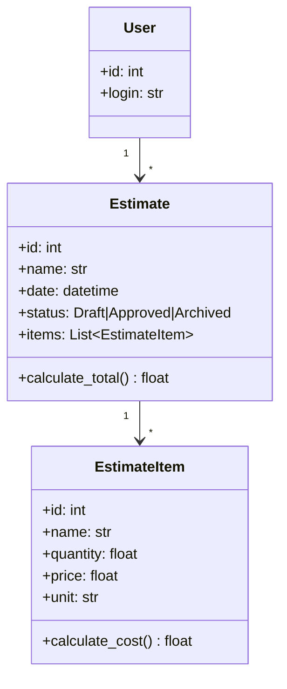
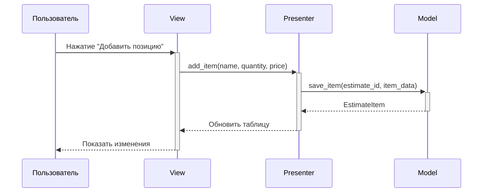
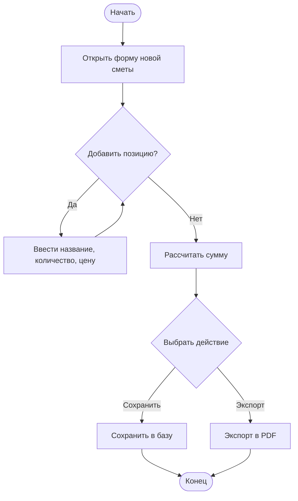
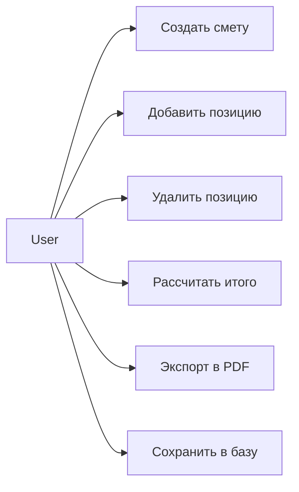
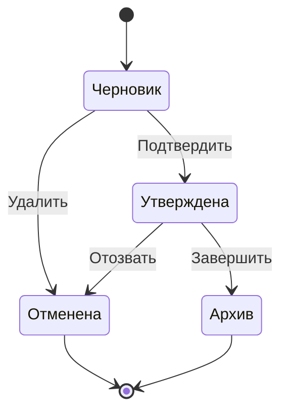

# Class Diagram

```mermaid
classDiagram
    class Estimate {
        +id: int
        +name: str
        +date: datetime
        +status: Draft|Approved|Archived
        +items: List~EstimateItem~
        +calculate_total() float
    }
    class EstimateItem {
        +id: int
        +name: str
        +quantity: float
        +price: float
        +unit: str
        +calculate_cost() float
    }
    class User {
        +id: int
        +login: str
    }
    Estimate "1" --> "*" EstimateItem
    User "1" --> "*" Estimate
```

# Sequence Diagram

```mermaid
sequenceDiagram
    Пользователь->>+View: Нажатие "Добавить позицию"
    View->>+Presenter: add_item(name, quantity, price)
    Presenter->>+Model: save_item(estimate_id, item_data)
    Model-->>-Presenter: EstimateItem
    Presenter-->>-View: Обновить таблицу
    View-->>-Пользователь: Показать изменения
```

# Activity Diagram

```mermaid
flowchart TD
    A([Начать]) --> B[Открыть форму новой сметы]
    B --> C{Добавить позицию?}
    C -->|Да| D[Ввести название, количество, цену]
    D --> C
    C -->|Нет| E[Рассчитать сумму]
    E --> F{Выбрать действие}
    F -->|Сохранить| G[Сохранить в базу]
    F -->|Экспорт| H[Экспорт в PDF]
    G & H --> I([Конец])
```

# Use Case Diagram

```mermaid
flowchart LR
    User --> CreateEstimate["Создать смету"]
    User --> AddItem["Добавить позицию"]
    User --> DeletePosition["Удалить позицию"]
    User --> CalculateTotal["Рассчитать итого"]
    User --> ExportToPDF["Экспорт в PDF"]
    User --> SaveToDatabase["Сохранить в базу"]
```

# State Diagram

```mermaid
stateDiagram-v2
    [*] --> Черновик
    Черновик --> Утверждена: Подтвердить
    Утверждена --> Архив: Завершить
    Черновик --> Отменена: Удалить
    Утверждена --> Отменена: Отозвать
    Отменена --> [*]
    Архив --> [*]
```

