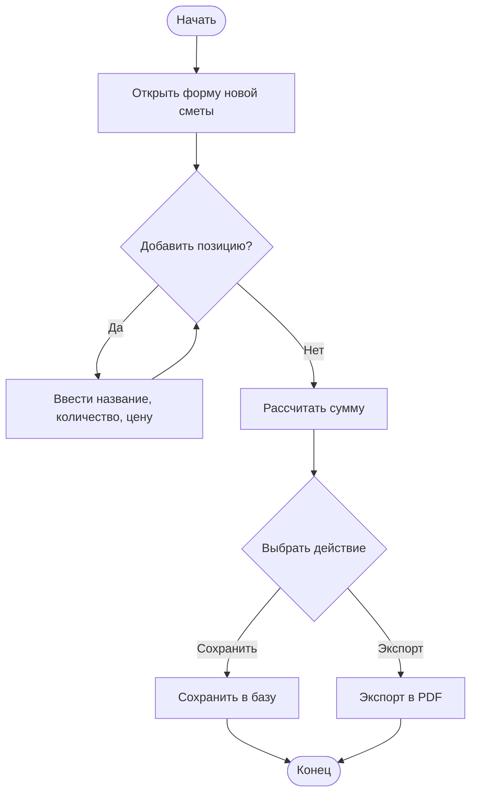
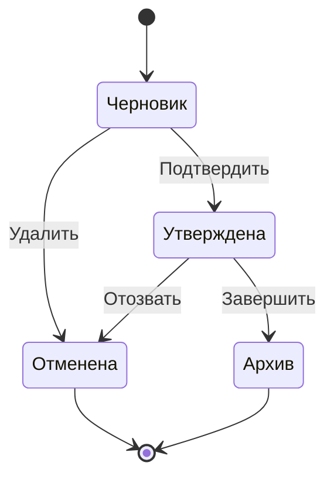

# Activity Diagram

```mermaid
flowchart TD
    A([Начать]) --> B[Открыть форму новой сметы]
    B --> C{Добавить позицию?}
    C -->|Да| D[Ввести название, количество, цену]
    D --> C
    C -->|Нет| E[Рассчитать сумму]
    E --> F{Выбрать действие}
    F -->|Сохранить| G[Сохранить в базу]
    F -->|Экспорт| H[Экспорт в PDF]
    G & H --> I([Конец])
```

# State Diagram

```mermaid
stateDiagram-v2
    [*] --> Черновик
    Черновик --> Утверждена: Подтвердить
    Утверждена --> Архив: Завершить
    Черновик --> Отменена: Удалить
    Утверждена --> Отменена: Отозвать
    Отменена --> [*]
    Архив --> [*]
```

